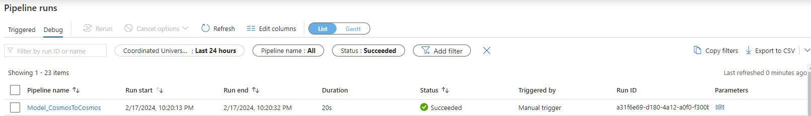

Incremental copy from Cosmos DB using OpenAI API to Cosmos DB
==========================================

This article describes a solution model that you can use to copy items from a Cosmos DB Source Container by filtering via query the attributes through the Lookup activity and using the copy activity to iterate the items with OpenAI API to store the JSON in the container Cosmos DB destination.

About this solution template
----------------------------

This model retrieves items from a Cosmos DB source container through the Lookup activity, with the necessary attributes being selected via query, and the Lookup output is dynamically configured in the Foreach activity that iterates the items, passing each attribute to the copy activity that was configured with the sink defining the OpenAI parameters storing the resulting JSON in a Cosmos DB destination container.

For example:

-   Cosmos DB 
        -   Database
            -   Container
                -   Items

How to use this solution template
---------------------------------

1.  Go to the **Incremental copy from Cosmos DB using OpenAI API to Cosmos DB** template.

    

2.  Create a **New** or use an existing connection to the source
    Cosmos DB and REST linked service.

    

3.  Create a **New** or use an existing connection to the Cosmos DB source.

    Follow these steps if you need to create a new REST linked service.
    
    1.  Select “+ New" from the **REST** dropdown list.
    
        
    
    2.  See [REST Linked Service](REST%20Linked%20Service.md) for information on setting up the REST linked service.

4.  Select **Use this template**.

5.  You will see a pipeline created as shown in the following example:

    

Pipeline
--------

### Parameters

1.  **model:** The Model chosen for this template is gpt-3.5-turbo, other models can be checked in the official OpenAI API documentation.

2.  **token:** The OpenAI Token is an authentication key necessary for accessing OpenAI's services via its API. It's obtained upon registration and grants access to the API. This unique token must be included in every request to authenticate and authorize access to the services provided by OpenAI.

    

Lookup Activity
-------------

### Settings

1.  **First row only:** Indicates whether to return just the first row or all rows. In our template we are using this unchecked option to get all items from the Cosmos DB container.

2.  **Use query:** Define in the query an attribute of the Cosmos DB container item that will be read by the Rest API later in the copy activity.

    

Copy Activity
-------------

### Source

1.  Dataset properties:

    1.  **Request body** - Using the Pipeline expression builder, the "content" property of the second "messages" array object must be changed with the Cosmos DB container item attribute defined in the Lookup Activity query.
    
    2.  **Additional columns** - Note that it is possible to add new attributes dynamically, where their values ​​can be obtained according to the Lookup activity query. These Attributes will be added to the JSON that will be copied to the Cosmos DB Container.
        
        

Publish
-------

Once you are finished with all your changes, click **Publish All**.

Triggering
----------

1.  To run the pipeline now, select **Add Trigger** and select **Trigger
    now**. Press **OK** at the Pipeline run prompt.

2.  Select **Monitor** tab in the left navigation panel and wait for
    about 20 seconds. Click **Refresh** to get the updated run status.

3.  When the pipeline run completes successfully, you would see results
    like the following example:

    

4.  You should also see the output items in the Cosmos DB container.

    

Next steps
----------

-   [Introduction to Azure Data
    Factory](https://github.com/MicrosoftDocs/azure-docs/blob/master/articles/data-factory/introduction.md)

-	[Open AI Official Documentation](https://platform.openai.com/docs/guides/text-generation/chat-completions-api)
