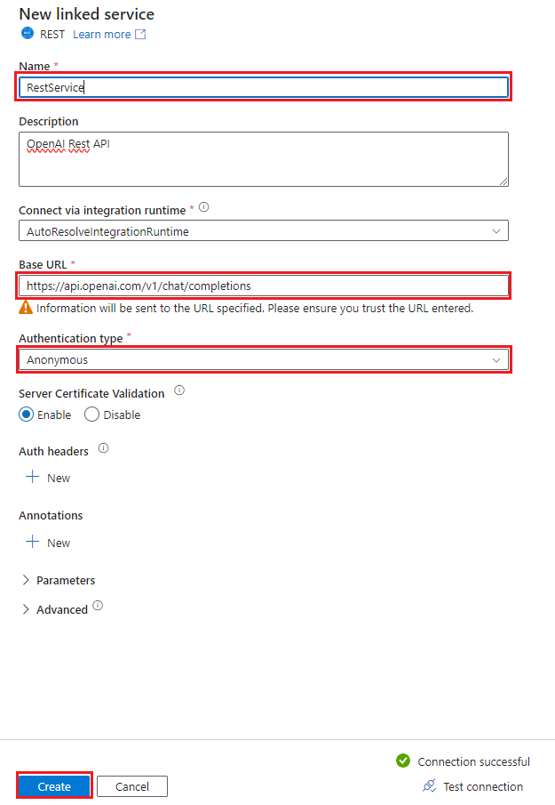

Configuring the REST Linked Service
=========================================

The REST linked service copies data to and from a REST endpoint, specifically the OpenAI API REST.

Prerequisites
-------------
* The OpenAI API Token is an authentication key required to access the services provided by OpenAI through its API. Upon registration and gaining access to the OpenAI API, you receive a unique token that must be included in each request you make to authenticate and authorize access to the offered services. 
* Choose a model to use in the API, in this template the gpt-3.5-turbo model was used.

Get Started
-----------
For detailed information on REST linked service, see [Copy data from and to a REST endpoint by using Azure Data Factory](https://docs.microsoft.com/en-us/azure/data-factory/connector-rest).

To use API key authentication, you will need to select authentication type as “Anonymous” and specify API key in the header.

Enter the following information for the REST linked service to connect to the OpenAI Rest API. 

Steps
-----

1.  Name: Enter a unique name for your REST linked service.
2.  Description: Enter an optional description.
3.  Integration runtime: You can select the auto resolve option or create a custom integration runtime. Some linked services that ADF integrates with requires the ADF integration runtime be in
	the same region as the service. In this case you will need to create a custom integration runtime in the same region as that linked service.
4.  Base URL: enter the base URL to Chat Completions API call da OpenAI.
	1. URL: https://api.openai.com/v1/chat/completions
5.  Authentication type: select **Anonymous**
6.  The Model and Token will be defined through pipeline parameters after creating the template.
			
More Information
----------------
-	[Open AI Official Documentation](https://platform.openai.com/docs/guides/text-generation/chat-completions-api)
